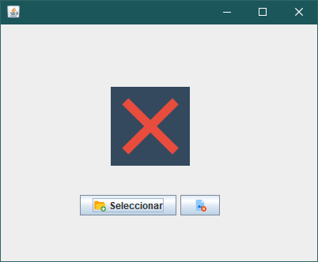
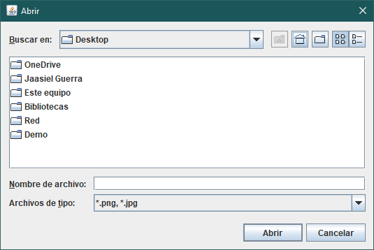
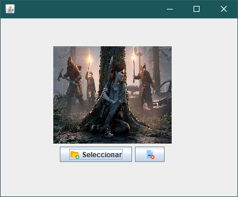
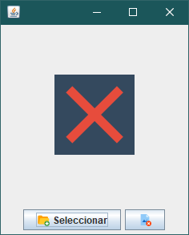
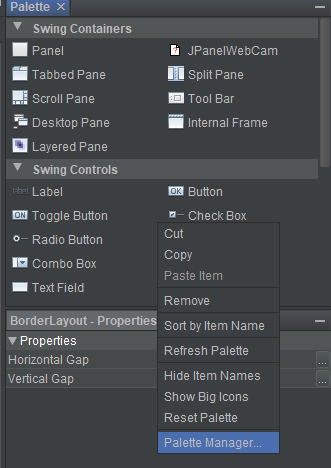
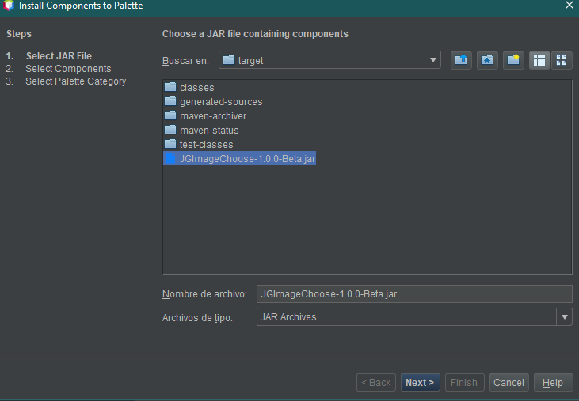
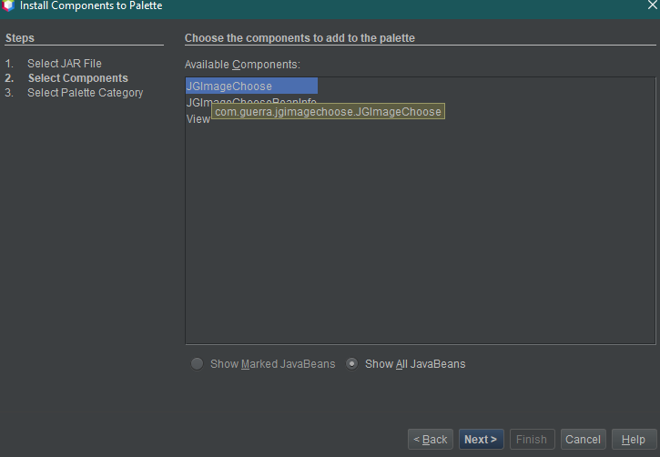
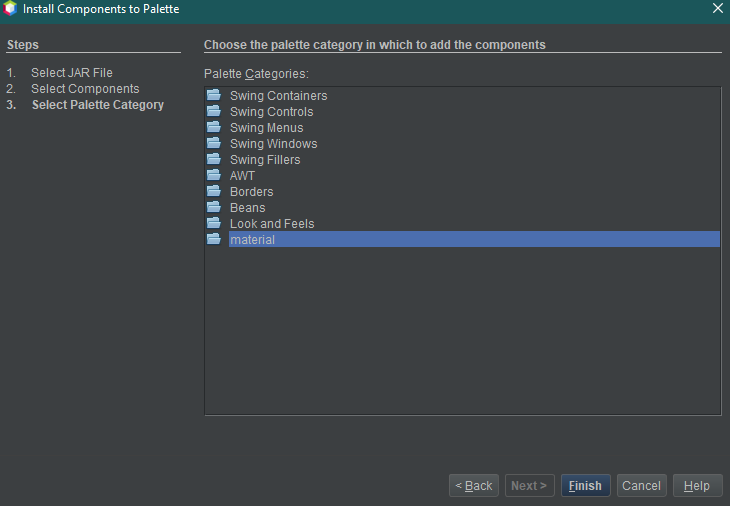
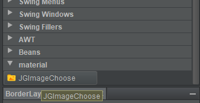

# JGImageChoose
Componente Java Swing para cargar imágenes del explorador de archivos.

Facilita la carga de imágenes de disco, poder visualizarlas y posteriormente obtenerlas como objeto o su ruta.

## Capturas de pantalla




## Características
- Las imágenes cargadas se ajustan al tamaño del componente.
- Se puede asignar una imagen cargada por defecto como:
    - byte[]
    - ImageIcon
    - Ruta de la imagen
- Obtener la imagen seleccionada como:
    - byte[]
    - ImageIcon
    - Ruta de la imagen
    - ***NOTA:*** *la imagen obtenida conservará las dimensionas exactas del archivo de orígen*
- Se puede eliminar la imagen seleccionada (cargada).
- Se puede cambiar los iconos de los botones y el texto.

# información para el desarrollador

## Herramientas

- Apache netbeans v11.2.
- Apache maven (proporcionado por el IDE).

## Lenguaje

- Java versión 8.

## Dependencias

- Ningúna

# Uso

## 1. Agregando JGImageChoose a su proyecto 

Como primer paso deberá agregar el componente a su proyecto, vaya a las realeses del proyecto y descargue `JGImageChoose-1.0.0.jar` y agréguelo a su ruta de compilación, y listo!.

### Repositorio maven
[](https://jitpack.io/#JaasielGuerra/JGImageChoose)

1. Agregue el JitPack repositorio al `pom.xml`

````xml
   <repositories>
      <repository>
         <id>jitpack.io</id>
	 <url>https://jitpack.io</url>
      </repository>
   </repositories>
````

2. Agregue la dependencia

````xml
   <dependency>
      <groupId>com.github.JaasielGuerra</groupId>
      <artifactId>JGImageChoose</artifactId>
      <version>{Latest release}</version>
   </dependency>
````

## 2. Agregando el componente a su UI

### Instanciando el componente directamente en su código:

````java
package com.guerra.jgimagechoose;

import javax.swing.JFrame;
import javax.swing.SwingUtilities;

public class DemoImg extends JFrame {

    private JGImageChoose choose;

    public DemoImg() {
        cargarComponentes();
    }

    private void cargarComponentes() {
        setDefaultCloseOperation(JFrame.EXIT_ON_CLOSE);
        setLocationRelativeTo(null);
        setSize(250, 300);
        
        this.choose = new JGImageChoose();
        getContentPane().add(choose);
    }

    public static void main(String[] args) {
        SwingUtilities.invokeLater(() -> {

            new DemoImg().setVisible(true);

        });
    }

}
````


### Puede agregar el componente al `Palette Manager` en Netbeans:

- Para agregar el compente simplemente de click derecho y seleccione `Palette Manager`

    

- Click sobre `add from JAR` y búsque el `JGImageChoose-1.0.0.jar` y selecciónelo. Luego click en `next`

    

- Deberá seleccionar `JGImageChose` y luego click en `next`

    

- Asigne el componente en la categoría que desee, en el ejemplo se ha creado una llamada `material`

    

- Finalizado los pasos debería aparecer el componente en el `Palette Manager` dentro de la categoría donde lo asignó. Y eso es todo, el componente está listo para ser usado.

    

# Referencias

## Métodos públicos

````java
    /**
     * Darle un tamanio al label de la imagen.
     *
     * <p>
     * Por defecto el tamanio de la imagen sera 200 x 200.
     * <p>
     *
     * @param width su ancho
     * @param height su algo
     */
    public void setImagePreferredSize(int width, int height);

    /**
     * Devuelve la extension del archivo seleccionado.
     * <p>
     * Si el usuario no ha seleccionado nada, devolvera null.
     *
     * @return String de la extension.
     * <p>
     * Null en caso de no existir.
     */
    public String getExtensionFile();

    /**
     * Asigna un texto al boton.
     *
     * @param text El texto a asignar
     */
    public void setTextButtonSelect(String text);

    /**
     * Devuelve el texto del boton.
     *
     * @return String del texto.
     */
    public String getTextButtonSelect();

    /**
     * Asigna un icono al boton.
     *
     * @param icon El icono a asignar
     */
    public void setIconButtonSelect(ImageIcon icon);

    /**
     * Asigna un icono al boton.
     *
     * @param icon El icono a asignar
     */
    public void setIconButtonDelete(ImageIcon icon);

    /**
     * Devuelve la ruta de la imagen seleccionada por el usuario.
     * <p>
     * En caso de no haber seleccionado una imagen, entonces devolvera la ruta
     * de la imagen que se haya asignado con el metodo
     * <code>setImagePath</code>.
     *
     * Si no se asigno o selecciono ninguna imagen, entonces devolvera null.
     *
     * @return String (imagen asignada o seleccionada).
     * <p>
     * Null en caso de no existir.
     */
    public String getImagePath();

    /**
     * Asignar una imagen al componente.
     *
     * @param imagePath La ruta de la imagen.
     */
    public void setImagePath(String imagePath);

    /**
     * Devuelve la imagen seleccionada por el usuario.
     * <p>
     * En caso de no haber seleccionado una imagen, entonces devolvera la imagen
     * que se haya asignado con el metodo <code>setImageIcon</code>.
     *
     * Si no se asigno o selecciono ninguna imagen, entonces devolvera null.
     *
     * @return imageIcon (imagen asignada o seleccionada).
     * <p>
     * Null en caso de no existir.
     */
    public ImageIcon getImageIcon();

    /**
     * Asignar una imagen al componente.
     *
     * @param imageIcon La imagen a setear.
     */
    public void setImageIcon(ImageIcon imageIcon);

    /**
     * Devuelve los bytes de la imagen seleccionada por el usuario.
     * <p>
     * En caso de no haber seleccionado una imagen, entonces devolvera los bytes
     * de la imagen que se hayan asignado con el metodo
     * <code>setImageByte</code>.
     *
     * Si no se asigno o selecciono ninguna imagen, entonces devolvera null.
     *
     * @return byte[] (imagen asignada o seleccionada).
     * <p>
     * Null en caso de no existir.
     */
    public byte[] getImageByte();

    /**
     * Asignar una imagen en bytes.
     *
     * @param imageByte Los bytes de la imagen.
     */
    public void setImageByte(byte[] imageByte);
````
